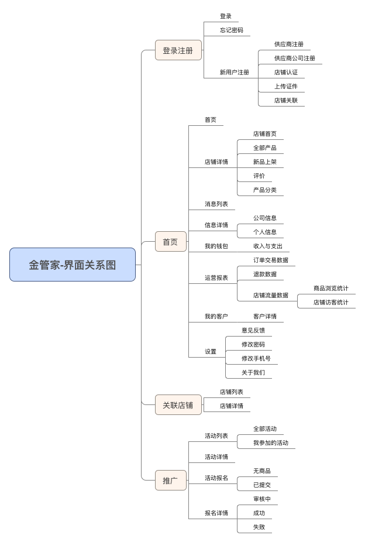
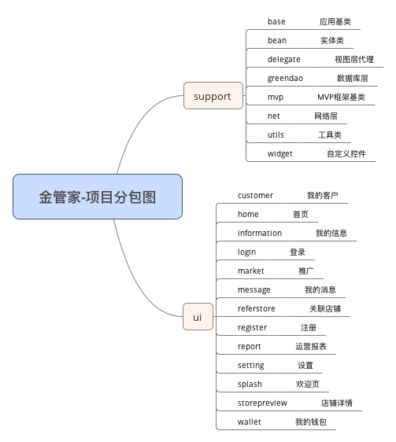

#金管家App#

##1.应用描述##

用于供应商的产出监控以及子账户的管理

##2.beta版开发说明

1. 初步的框架集成   (2016-10-18)
1. 暂时使用ios版本的切图
1. 实现首页界面和信息界面(2016-10-19)
1. 实现我的钱包界面,以及提现和收入与支出界面(2016-10-20)
1. 实现安全中心与运营报表一级界面(2016-10-21)

##3.金管家-界面关系图

##4.金管家-项目分包图

