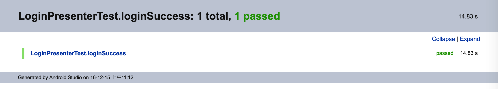

# 金管家App

## 1.应用描述

用于供应商的产出监控以及子账户的管理

## 2.金管家-界面关系图


## 3.金管家-项目分包图


## 4.MVP架构说明

M:数据模型层

V:视图逻辑层，由Activity或Fragment实现,主要包括控件的显示、手势的处理、页面的跳转

P:业务逻辑层,尽量不依赖Android环境以便单元测试，主要包括数据的获取和处理、线程的切换

原则：P通过接口抽象依赖V,V不直接调用M。

例如：以登录模块为例

>
1. 创建一个LoginActivity，持有LoginPresenter的泛型，实现LoginView
2. 创建LoginPresenter继承BasePresenter,创建LoginView继承BaseView
3. 在LoginActivity中使用ButterKnife自动实现视图注入和点击事件注入

```java
public class LoginActivity extends BaseMvpActivity<LoginPresenter> implements LoginView {

     @BindView(R.id.et_your_phone)
     EditText etYourPhone;
     @BindView(R.id.et_pwd)
     EditText etPwd;

    @Override
    protected  int createLayoutId(){
        // TODO: 获取布局id
    }

    @Override
    protected LoginPresenter createPresenter(){
        // TODO: 创建LoginPresenter
    }

    @Override
    public void refreshPhone(String phone) {
        // TODO: 刷新手机
    }

    @Override
    public void gotoStoreOwnerVerify(int index) {
        // TODO: 跳转到店铺认证页
    }

    @Override
    public void gotoHome() {
        // TODO: 跳转到主页
    }

    @OnClick({R.id.iv_clear, R.id.iv_transfer_pwd, R.id.btn_login, R.id.tv_register, R.id.tv_forget_pwd})
    public void onClick(View v) {
        switch (v.getId()) {
            case R.id.iv_clear:
                // TODO: 清空手机号
                break;
            case R.id.iv_transfer_pwd:
                // TODO: 切换密码显示
                break;
            case R.id.btn_login:
                // TODO: 调用Presenter执行登录
                presenter.login();
                break;
            case R.id.tv_register:
                // TODO: 跳转到注册页
                break;
            case R.id.tv_forget_pwd:
                // TODO: 跳转到忘记密码页
                break;
        }
    }
}
```

```java
public interface LoginView extends BaseView {

    void refreshPhone(String phone);

    void gotoStoreOwnerVerify(int index);

    void gotoHome();
}
```

```java
public class LoginPresenter extends BasePresenter<LoginView> {
    public void login(String phone, String password) {
        // TODO: 执行登录
    }
}
```

## 5.单元测试说明

因为jdk中并没有Android运行环境，直接在JUnit中调用Android的方法会报Stub异常!

而直接在安卓模拟器或者真机上跑测试用例速度又超级慢，不利于测试驱动开发。

所以，这里引用了Robolectric，因为它通过实现一套JVM能运行的Android代码，从而做到脱离Android环境进行测试。

这里我们主要是对Presenter层进行测试。

例如：以LoginPresenter为例

因为我们前面让Presenter抽象依赖了View，所以这里可以直接Mock掉LoginView。

如果不是为了验证SP中是否存储了数据，我们甚至可以连Robolectric都不必使用。

不过考虑到Presenter中可能经常会和SP、SQLite、Toast打交道，所以使用Robolectric还是有必要的。

```java
@RunWith(RobolectricTestRunner.class)
public class LoginPresenterTest {

    LoginView view;
    LoginPresenter presenter;
    Context context;

    @Before
    public void setUp() {
        ShadowLog.stream = System.out;
        BaseConfig.IS_TEST = true;
        context = RuntimeEnvironment.application;
        ShowWidgetUtil.register(context);
        SPUtil.init(context);

        view = Mockito.mock(LoginView.class);
        presenter = new LoginPresenter();
        presenter.attachView(view);
    }

    @Test
    public void loginSuccess() throws InterruptedException {
        //调用presenter的login
        String phone = "15221234567";
        String password = "s111111";
        presenter.login(phone, password);

        //验证view是否执行了gotoHome
        Mockito.verify(view).gotoHome();

        //验证SP中是否存储了手机号
        String value = SPUtil.getValue(SpKey.USER_PHONE, "");
        assertThat(value).isEqualTo("15221234567");
    }
}
```

然后，run一下test包，可得到测试报告：


以后，每次重构完成、发布测试版前，均应run一下test包，得到最新测试报告，保证每个测试用例均通过。

## 6.RxJava说明

RxJava是一个针对于Java语言的一个异步的响应式编程库，方便我们像调用同步的方法那样去调用异步的方法，避免多层回调的嵌套。

主要包括四个要素：
>
1. Observable:事件发射器
2. Subscriber:事件接收器
3. Operator：操作符
4. Scheduler:线程调度器

[RxJava文档中文版](https://github.com/mcxiaoke/RxDocs)

[RxJava使用场景总结](http://www.jianshu.com/p/2d567b1d93c3)

在本项目中,我们在Application中创建了一个全局的线程调度器Scheduler。
```
private void initScheduler() {
    //核心有2个线程，最大线程数量为20，存活时间60s
    ExecutorService customThreadExecutor = new ThreadPoolExecutor(2, 20, 60L, TimeUnit.SECONDS, new LinkedBlockingQueue<Runnable>());
    scheduler = Schedulers.from(customThreadExecutor);
}
```

之后,所有需要使用异步的地方都不要自己new Thread(),统一使用Scheduler
```
Observable.just(1)
        .map(var -> initProvinceAndCity())//初始化城市
        .subscribeOn(BaseApplication.getScheduler())//在子线程执行
        .observeOn(AndroidSchedulers.mainThread())//在主线程返回执行结果
        .subscribe();
```

## 7.网络框架说明

本项目的网络框架是基于OkHttp+Retrofit+RxJava封装的。

通过自定义OkHttp的Interceptor实现缓存策略、头信息修改、重试等
通过自定义Retrofit的Converter实现封装Request、解析Response
通过自定义Retrofit的CallAdapter实现了网络请求接口的自定义
通过自定义RxJava的Subscriber基类实现统一的网络错误处理

例如：以登录接口为例

>
1. 在IWebModel中定义login方法
2. 在Presenter中调用login方法

```java
public interface IWebModel {

    //登录
    @POST("User/login")
    ObservableWrapper<BaseResponse<UserServerParams>> login(@Body UserServerParams request);
}
```
```java
public class LoginPresenter extends BasePresenter<LoginView> {

    public void login(String phone, String password) {
        BaseApplication.getWebModel()
                .login(mParams)//调用login方法
                .sendTo(new BaseSubscriber<BaseResponse<UserServerParams>>(getView()) {
                    @Override
                    public void onSuccess(BaseResponse<UserServerParams> response) {
                        responseLogin(response);//解析login的响应值
                    }
                });
    }
}
```

## 8.万能Adapter说明

### 简单的列表

>
1. 创建SingleAdapter时，持有Bean的泛型,构造方法中传入item的布局id
2. 调用adapter.setData(list),传入List<Bean>即可

```
public void initView() {
    SingleAdapter adapter = new SingleAdapter<Bean>(getActivity(), R.layout.item_bean) {
        @Override
        protected void bindData(BaseViewHolder holder, Bean item, int position) {
            // TODO: 绑定数据
        }

        @Override
        protected void bindListener(BaseViewHolder holder, Bean item, int position) {
            // TODO: 绑定事件监听
        }
    };
    rv.setAdapter(adapter);
}
```

```
public void initData(List<Bean> list){
    adapter.setData(list);
}
```

### 复杂的列表，有多种Item

>
1. 创建SuperAdapter时，构造方法中传入item的布局id数组
2. 调用adapter.setData(list)时，需要先将原始数据转成List<LayoutWrapper>
3. 分别为不同的Item创建不同的DataHolder,负责各自的数据绑定和事件监听

其实，SuperAdapter还可以实现不同的Item的Span也不一样，这里使用比较复杂，就不细说了，自己查看源码即可。

```
private void initView() {
    adapter = new SuperAdapter(getActivity(), layoutIds);
    rvContent.setAdapter(adapter);
}
```

```
private void initData() {
    List<LayoutWrapper> data = new ArrayList<>();

    data.add(new LayoutWrapper(R.layout.item_line, "", null));

    data.add(new LayoutWrapper(R.layout.item_group, groupName, groupHolder));

    data.add(new LayoutWrapper(R.layout.item_chesun, new Bean(name, path), beanHolder));

    adapter.setData(data);
}
```

```
DataHolder<Bean> beanHolder = new DataHolder<Bean>() {
     @Override
     protected void bindData(BaseViewHolder holder, Bean item, int position) {
         // TODO: 绑定数据
     }

     @Override
     protected void bindListener(BaseViewHolder holder, Bean item, int position) {
         // TODO: 绑定事件监听
     }
};
```

## 9.UI架构说明（待完成）

思路：将常用的UI功能控件抽离出来，独立成一个个的自定义控件，按需组装

1. 公用导航栏
2. 公用网络异常视图
3. 公用服务器异常视图
4. 公用空数据视图
5. 公用下拉刷新视图
6. 公用上拉加载视图
7. 公用底部自动加载视图